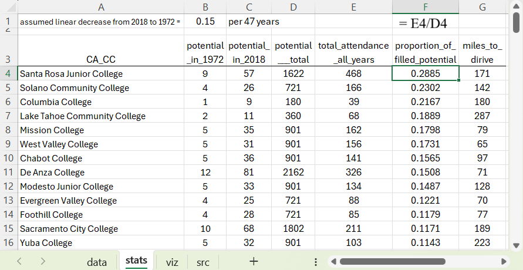
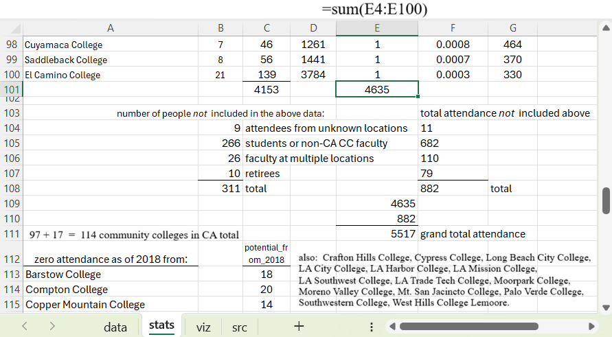
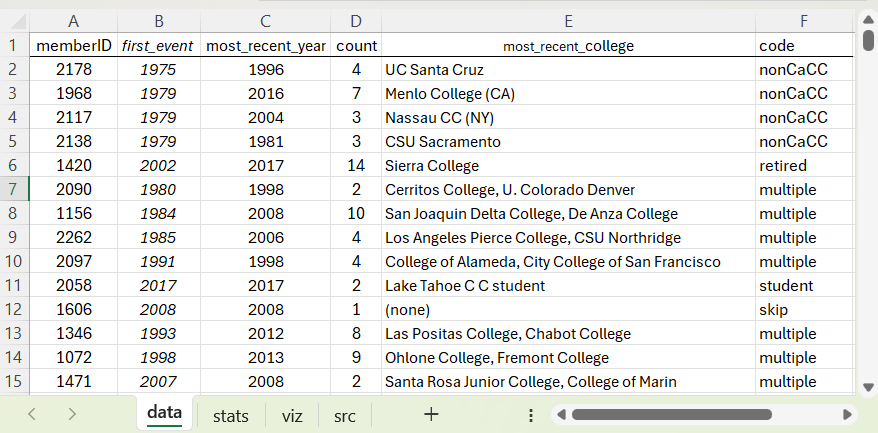
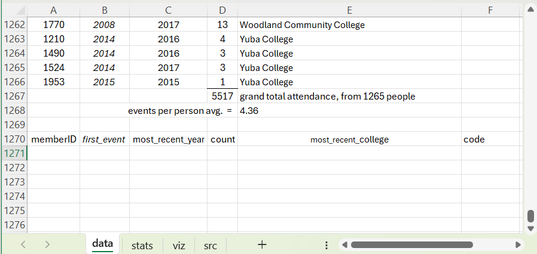

# analysis
Analysis of attendance data for annual professional development conferences 1972-2018.

For these 97 community colleges which supported at least 1 person to attend at least one conference, potential is a function of department size, ranging from 3 to 60 people per department.  Less than 30% of the variability in attendance effort is explained by the driving distance between the conference and the college.

The plots were based on these summary statistics.

The statistics were based on these data of individual people.

The viz + stats + data are all tabs in the attendee_history.xlsx file.
